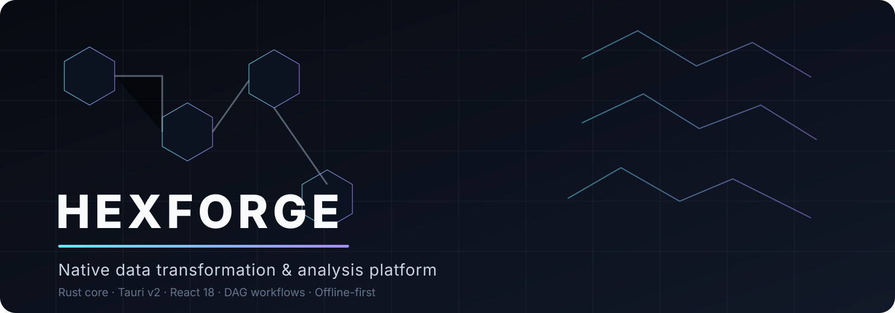
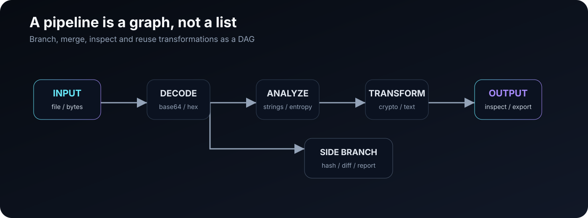
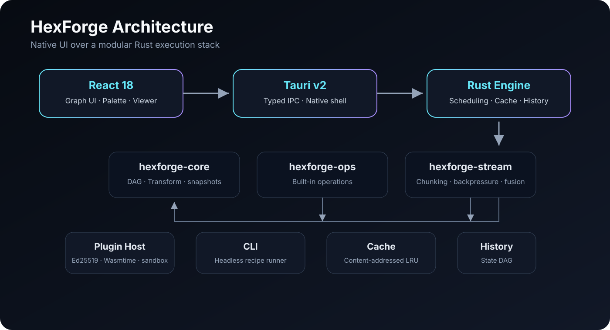

<div align="center">
  

  <h1>HexForge</h1>

  <p><strong>Native data transformation & analysis platform</strong></p>
  <p>Compose, inspect, transform and analyze arbitrary data through a visual DAG — locally, natively and without browser limitations.</p>

  <p>
    <a href="https://github.com/Manivero/HexForge/actions"></a>
    <a href="https://github.com/Manivero/HexForge"></a>
    <a href="https://github.com/Manivero/HexForge/commits/main/"></a>
    
    
    
    <a href="LICENSE"></a>
  </p>

  <p>
    <a href="#why-hexforge">Why HexForge</a> ·
    <a href="#capabilities">Capabilities</a> ·
    <a href="#architecture">Architecture</a> ·
    <a href="#getting-started">Getting Started</a> ·
    <a href="#documentation">Documentation</a>
  </p>
</div>

---

## Why HexForge?

Most data-processing utilities are designed as a list of sequential steps. HexForge treats the workflow itself as a **directed acyclic graph (DAG)**: operations become nodes, data moves along edges, and a single workflow can branch, merge, be inspected, cached and replayed.

That model is the core idea behind the project.

| Traditional recipe workflow | HexForge |
| --- | --- |
| Linear sequence | **DAG / Node Graph** |
| One path through the data | **Branching & fan-out** |
| Re-run everything | **Content-addressed caching** |
| Weak state history | **Time-travel snapshots** |
| GUI-only workflows | **GUI + headless CLI** |
| In-memory-first processing | **Chunked streaming pipeline** |

<div align="center">
  
</div>

---

## What it is

HexForge is a native desktop application for **data transformation, binary analysis, reverse engineering, digital forensics, cryptography and automation**. It is aimed at security researchers, malware analysts, DFIR specialists, reverse engineers and CTF players who need a fast way to decode, transform and inspect arbitrary bytes locally.

The application combines a **React 18 frontend** with a **Tauri v2 shell** and a modular **Rust workspace**. The execution layer is separated from the UI so the same engine can power the desktop application and the CLI.

> **Offline-first by design:** production builds enforce a restrictive CSP, the WebView has no direct filesystem/network permissions, and the Tauri boundary is typed.

---

## Capabilities

<div align="center">
  
</div>

### 🧩 Compose workflows visually

- DAG-based Node Graph instead of a linear recipe list
- Multiple inputs/outputs at the operation level
- Command Palette (`⌘K`) for fuzzy command and operation discovery
- Portable recipe import/export
- Snapshot history with branching and diffing

### 🔬 Inspect and analyze

- Hex Viewer / Editor with paginated hex dumps and byte patching
- Printable string extraction for ASCII and UTF-16
- Shannon entropy analysis
- ELF, PE and Mach-O header inspection
- Magic-byte detection
- PCAP and protocol-oriented parsing

### 🔐 Transform securely

- Base32 / Base58 / Base64 / Base85 / Hex
- SHA, SHA3, BLAKE, MD5, CRC32 and HMAC
- XOR, RC4, AES and AEAD constructions
- ChaCha20 and ChaCha20-Poly1305
- URL, JWT, HTTP, DNS, IP and User-Agent parsing
- JSON / XML / YAML formatting

### 📦 Handle large data

The streaming layer uses chunked I/O, backpressure and pipeline fusion. Adjacent streamable nodes can be fused into one chunk loop, while parallel stages communicate through bounded channels. The current default chunk size is **64 MiB**.

### 🧱 Extend the platform

HexForge includes a plugin host with **Ed25519 manifest verification**, **Wasmtime fuel metering** and a **capability sandbox**. Built-in operations are registered through `inventory`, avoiding a central hard-coded operation list.

---

## Operations

HexForge currently groups its built-in transforms into these areas:

| Area | Examples |
| --- | --- |
| **Encoding** | Base32, Base58, Base64, Base85, Hex, JSON, XML, YAML, MessagePack, Protobuf |
| **Hashing** | BLAKE2, BLAKE3, CRC32, MD5, SHA-1, SHA-256, SHA-512, SHA3-256, SSDEEP, HMAC |
| **Cryptography** | ROT-N, XOR, RC4, AES, AES-GCM, ChaCha20, ChaCha20-Poly1305 |
| **Network** | URL, JWT, HTTP, DNS, IP, User-Agent, PCAP |
| **Text** | Case transforms, HTML entities, regex extract/replace, Unicode normalization, padding, trimming |
| **Compression** | Gzip, Zlib, Deflate, Bzip2, LZMA/XZ |
| **Streaming** | Concatenation, byte-level diff |
| **Binary Analysis** | Strings, entropy, ELF, PE, Mach-O, magic bytes |

For the authoritative per-operation list, see the repository's current `README.md` / operation registry and the implementation in [`crates/hexforge-ops`](https://github.com/Manivero/HexForge/tree/main/crates/hexforge-ops).

---

## Architecture

HexForge is intentionally split into small crates with clear responsibilities. The workspace currently contains the core domain model, operation registry, streaming layer, execution engine, CLI and Tauri shell.

| Component | Responsibility |
| --- | --- |
| `hexforge-core` | DAG domain model, `Transform` trait and snapshots; zero I/O |
| `hexforge-ops` | Built-in transformations and operation registration |
| `hexforge-stream` | Chunked I/O primitives and streaming execution support |
| `hexforge-engine` | Scheduling, caching, cancellation, history and diff |
| `hexforge-plugin-host` | Plugin verification, Wasmtime execution and capability sandbox |
| `hexforge-cli` | Headless recipe runner |
| `src-tauri` | Tauri shell and typed IPC bridge |
| `src` | React 18 frontend |

### Design principles

- **One operation contract:** the `Transform` trait is the common interface for built-in transforms.
- **Merge-aware nodes:** `MergeTransform` supports N-ary operations such as `concat`.
- **Compile-time discovery:** `inventory` registers operations without a central list.
- **Fused streaming:** adjacent streamable operations can share a chunk-processing loop.
- **Bounded parallelism:** streaming stages communicate via bounded channels.
- **Content-addressed caching:** memoization is keyed by operation/version, input hash and parameters.
- **Cooperative cancellation:** cancellation is checked at chunk boundaries.

---

## Getting Started

### Prerequisites

- Node.js **18+**
- Rust toolchain via `rustup`
- A platform supported by Tauri v2

### Run the frontend

```bash
npm install
npm run dev
```

The Vite development server is configured for the frontend workflow.

### Run the native application

```bash
npm install
npm run tauri dev
```

### Build a production application

```bash
npm run tauri build
```

### Run the CLI

```bash
cargo run -p hexforge-cli -- run recipe.hexforge --in input.bin --out output.bin
cargo run -p hexforge-cli -- validate recipe.hexforge
```

The current CLI supports headless recipe execution and validation.

---

## Testing & Quality

```bash
# Rust workspace
cargo test --workspace
cargo clippy --workspace --all-targets

# Streaming benchmarks
cargo bench -p hexforge-stream -- --verbose

# Frontend
npm run lint
npm run test:fe
npm run build
```

The frontend test command uses Node's built-in test runner, while the Rust workspace includes unit coverage in the operation crates.

---

## Security model

HexForge is designed to keep the desktop application boundary explicit:

- no application-level network access in the current offline design;
- restrictive production CSP (`default-src 'self'`);
- typed Tauri IPC contracts;
- no secrets committed to the repository;
- plugin manifests are verified and plugin execution is fuel-metered inside Wasmtime with capability restrictions.

Security issues should be reported privately rather than through public issues.

---

## Project layout

```text
HexForge/
├── crates/
│   ├── hexforge-cli/
│   ├── hexforge-core/
│   ├── hexforge-engine/
│   ├── hexforge-ops/
│   ├── hexforge-stream/
│   └── ...
├── src/                 # React frontend
├── src-tauri/            # Tauri v2 native shell
├── docs/                 # PRD, architecture, IPC and design docs
├── fe-tests/             # Frontend tests
├── Cargo.toml
├── package.json
└── README.md
```

The documentation folder currently includes the PRD, competitive gap analysis, information architecture, Rust core architecture, IPC contract, design system and project scaffold.

---

## Documentation

| Document | Purpose |
| --- | --- |
| [`01-PRD.md`](docs/01-PRD.md) | Product requirements and scope |
| [`02-COMPETITIVE-GAP-ANALYSIS.md`](docs/02-COMPETITIVE-GAP-ANALYSIS.md) | Competitive analysis |
| [`03-INFORMATION-ARCHITECTURE.md`](docs/03-INFORMATION-ARCHITECTURE.md) | UI / information architecture |
| [`04-RUST-CORE-ARCHITECTURE.md`](docs/04-RUST-CORE-ARCHITECTURE.md) | Core Rust architecture |
| [`05-IPC-CONTRACT.md`](docs/05-IPC-CONTRACT.md) | Frontend ↔ Tauri contract |
| [`06-DESIGN-SYSTEM.md`](docs/06-DESIGN-SYSTEM.md) | Visual design system |
| [`07-PROJECT-SCAFFOLD.md`](docs/07-PROJECT-SCAFFOLD.md) | Project scaffold and implementation status |

---

## Roadmap

### Done

- Native performance profiling via Criterion
- English / Russian i18n
- Ed25519 + Wasmtime plugin host with fuel metering and capability sandbox
- CyberChef recipe import
- Snapshot diffing
- AES-GCM and ChaCha20-Poly1305 AEAD support
- Compression operations
- Streaming / fusion pipeline work

### Future / Deferred

- Heuristic "Magic Wand" chain detection beyond the current `auto_decode`
- Real-time collaboration
- Cloud sync
- Mobile clients
- Further plugin Component Model / WIT work

The canonical implementation status remains in the repository docs and roadmap.

---

## Contributing

1. Fork the repository.
2. Create a feature branch:
   ```bash
   git checkout -b feature/my-feature
   ```
3. Run the project checks:
   ```bash
   cargo clippy --workspace --all-targets -- -D warnings
   cargo test --workspace
   cargo bench -p hexforge-stream --no-run
   npm run lint && npm run test:fe && npm run build
   ```
4. Commit using a descriptive Conventional Commit message.
5. Open a pull request.

---

## License

HexForge is released under the [MIT License](LICENSE).

---

<div align="center">
  <p><strong>HexForge</strong> — turn byte-level work into composable workflows.</p>
  <p>Built with Rust · Tauri · React</p>
</div>
